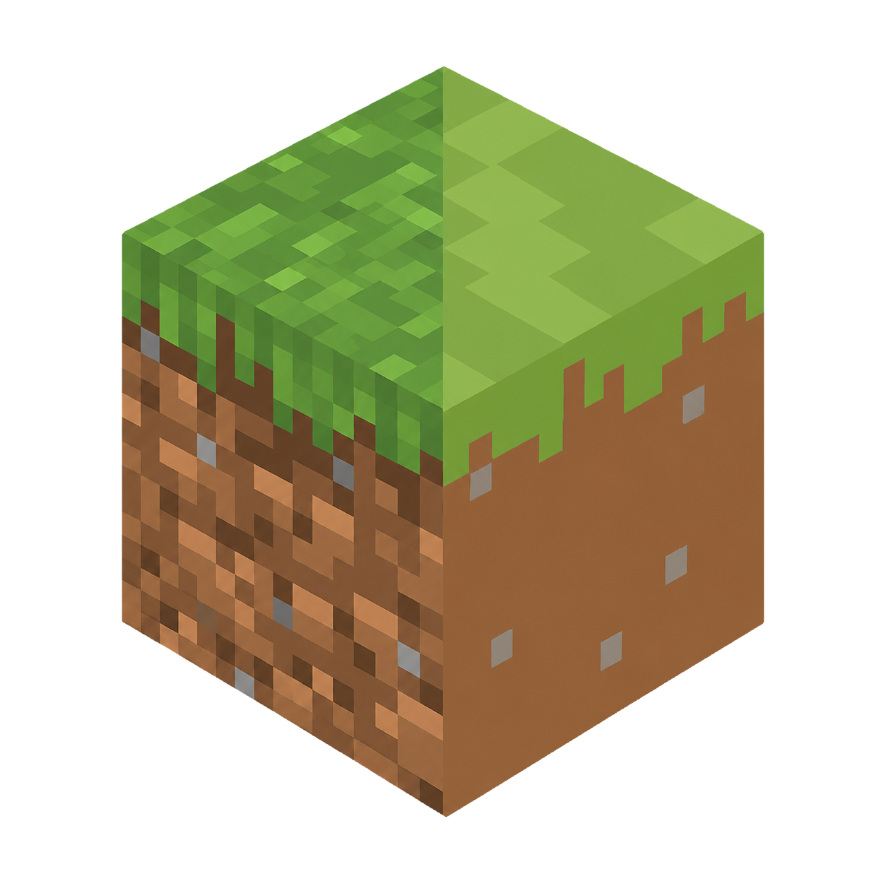
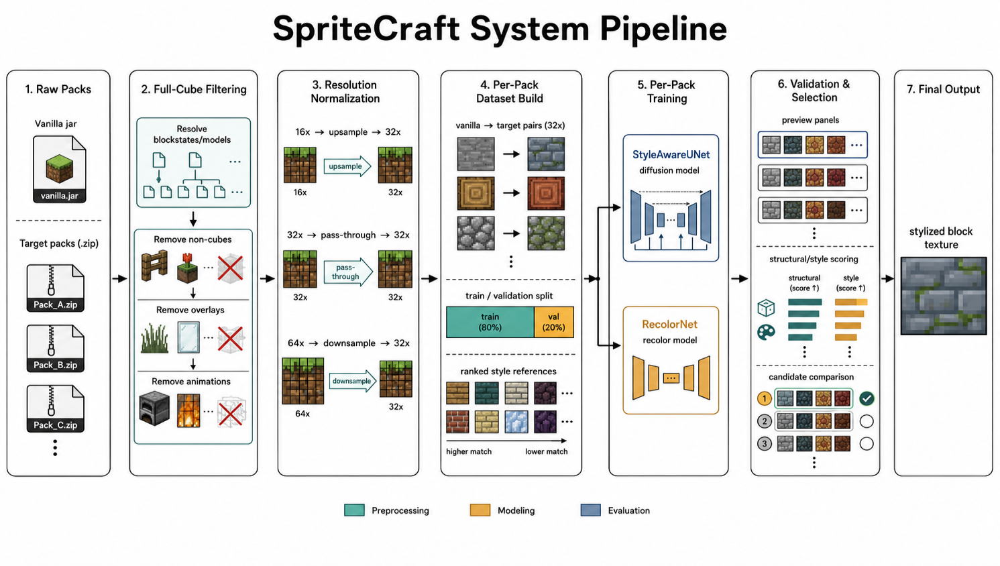
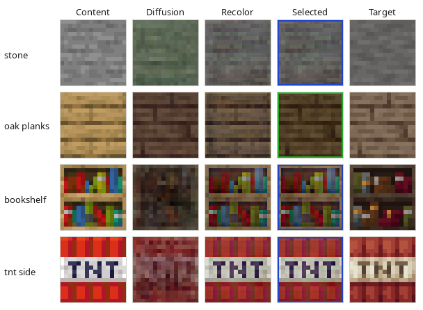

<div align="center">
  
  <h1>SpriteCraft</h1>
</div>

**Diffusion-based framework for synthesizing and stylizing block textures in Minecraft resource packs.**

*Ray Zhang &mdash; Shanghai Jiao Tong University*

---

## Overview

SpriteCraft is a per-pack training framework that ensembles style-conditioned diffusion with a complementary RecolorNet to generate block textures matching the visual style of a target Minecraft resource pack. Given vanilla textures as content anchors and reference textures from the target pack as style guides, the system produces stylized textures that preserve structural fidelity while adapting palette and detail to the target domain.

<div align="center">
  
</div>

### Why This Matters

Texture style transfer for pixel art is challenging: low resolution amplifies color errors, discrete palettes resist continuous-domain synthesis, and tileability imposes strong structural constraints. Diffusion models are powerful for natural images but are predominantly trained on photographic datasets. SpriteCraft bridges this gap with a lightweight dual-model architecture (~8.7M parameters total) that can be rapidly trained on general consumer GPU hardware.

### Key Features

- **Dual-model architecture.** A `StyleAwareUNet` (~7.7M params) performs 40-step DDPM diffusion conditioned on both vanilla content and multi-reference style textures, while `RecolorNet` (~1.0M params) provides a structure-preserving color-transfer fallback.
- **Content-aware auxiliary losses.** Source-relative structure, contrast, hue, and color-moment losses guide the diffusion model toward perceptually faithful outputs, with automatic source-close sample routing when the target stays near vanilla.
- **Ensemble routing at inference.** Multiple stochastic diffusion candidates are scored on structural quality and style agreement; RecolorNet is invoked when diffusion candidates fall below quality thresholds.
- **Wood-family specialization.** Planks and other wood textures receive dedicated routing to preserve grain regularity, a common failure mode in texture synthesis.

---

## Results

<div align="center">
  
  <br>
  <em>Oak planks transferred to four target resource packs. Each column shows vanilla content, the SpriteCraft output (Selected), RecolorNet fallback, pure diffusion output, and ground-truth target.</em>
</div>

<br>

<div align="center">
  
  <br>
  <em>Per-texture routing on the Ashen 16× pack, visualized across content, diffusion, RecolorNet, selected output, and target.</em>
</div>

For full experimental results, loss curves, and ablations, see the [project report](report/main.pdf).

---

## Model Architecture

### StyleAwareUNet

| Component | Description |
|-----------|-------------|
| Input | Noisy target RGB + vanilla content RGB, fused at entry |
| Encoder | `ResBlock` + strided conv: 32×32 → 16×16 → 8×8 |
| Style encoder | 3 reference textures → 8×8 style feature maps |
| Cross-attention | Content queries attend to style keys/values at bottleneck |
| Timestep embedding | Sinusoidal encoding + MLP, injected at bottleneck |
| Decoder | Skip connections from encoder at 32×32 and 16×16 |
| Output | Predicted diffusion noise ε (not clean RGB) |
| Parameters | ~7.7M |

### RecolorNet

| Component | Description |
|-----------|-------------|
| Content encoder | Encodes vanilla content texture |
| Style encoder | 3 reference textures, averaged with validity mask |
| Conditioning | Style features injected at bottleneck |
| Skip connection | Raw content RGB → decoder for structure preservation |
| Output | Residual added to content, clamped to [0, 1] |
| Parameters | ~1.0M |

<div align="center">
  
</div>

See [`docs/model.md`](docs/model.md) for detailed training configuration, loss function formulations, inference routing logic, and current limitations.

---

## Getting Started

### Prerequisites

- [git](https://git-scm.com/) and [uv](https://pypi.org/project/uv/)
- Python ≥ 3.10
- A vanilla Minecraft JAR file and one or more resource pack ZIPs (16× or 32× for best results)

### Installation

```bash
git clone https://github.com/RayZh-hs/SpriteCraft
cd SpriteCraft
uv sync
source .venv/bin/activate
```

### Data Preparation

1. Place the vanilla Minecraft JAR and target resource packs in `data/raw_packs/` (do not unzip).
2. Optionally create a `manifest.json` in `data/`:

```json
{
    "packs": [
        {
            "id": "my_pack",
            "archive": "My Pack.zip",
            "role": "train",
            "style": "stylized"
        }
    ]
}
```

3. Run preprocessing:

```bash
spritecraft preprocess
```

Preprocessed datasets are written to `data/processed/packs/<pack_id>/`.

### Training

```bash
# Train both models (RecolorNet first, then StyleAwareUNet)
spritecraft train --checkpoint-dir checkpoints/run_1 --steps 20000

# Train only StyleAwareUNet
spritecraft train --checkpoint-dir checkpoints/run_1 --steps 20000 --mode std_only

# Train only RecolorNet
spritecraft train --checkpoint-dir checkpoints/run_1 --steps 20000 --mode recolor_only
```

Monitor training with TensorBoard:

```bash
tensorboard --logdir checkpoints/run_1/tensorboard
```

### Generation

```bash
# Generate specific textures from a target pack
spritecraft generate --pack my_pack --textures stone dirt oak_planks

# Generate 8 random textures
spritecraft generate --pack my_pack --random 8

# Use a specific checkpoint
spritecraft generate --pack my_pack --textures stone --checkpoint checkpoints/run_1/my_pack/step_020000.pt
```

Outputs are written to `output/<pack_id>/<bundle>/` including the original texture, generated texture, side-by-side comparison, and metrics JSON.

---

## Project Structure

| Directory | Purpose |
|-----------|---------|
| `src/spritecraft/` | Main Python package |
| `src/spritecraft/data/` | Preprocessing, dataset, support indexing |
| `src/spritecraft/models/` | StyleAwareUNet, RecolorNet, diffusion schedule |
| `src/spritecraft/training/` | Training loops and loss functions |
| `src/spritecraft/inference/` | Generation, sampling, ensemble routing, evaluation |
| `src/spritecraft/debug/` | Runtime status and inspection utilities |
| `data/raw_packs/` | Input JAR/ZIP files |
| `data/processed/` | Preprocessed datasets |
| `checkpoints/` | Model checkpoints and TensorBoard logs |
| `output/` | Generated texture bundles |
| `report/` | LaTeX report, figures, and data |
| `poster/` | Conference poster |
| `scripts/` | Batch evaluation and report figure generation |
| `docs/` | Extended documentation |

---

## Citation

```bibtex
@misc{zhang2026spritecraft,
  title   = {SpriteCraft: Texture Style Transfer for Minecraft Resource Packs},
  author  = {Zhang, Ray},
  year    = {2026},
  url     = {https://github.com/RayZh-hs/SpriteCraft}
}
```
